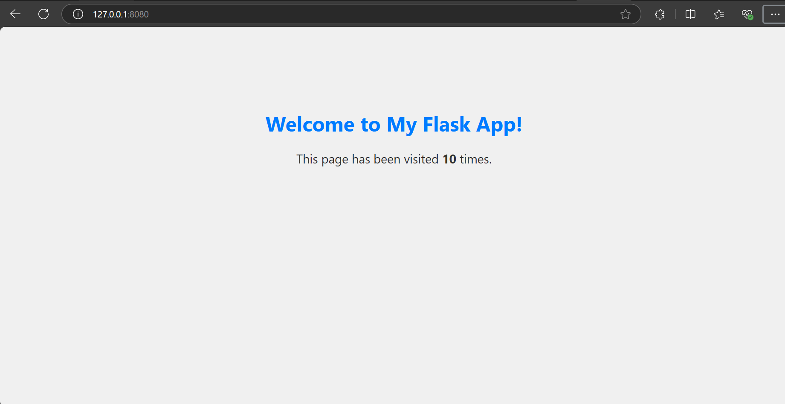
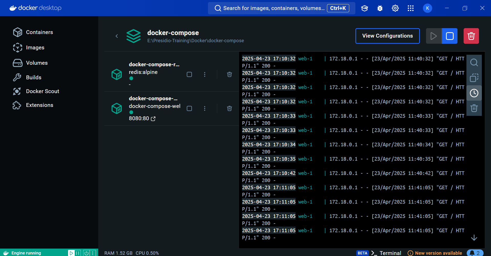

# Docker Compose

- It is a tool that helps to define and run multi-container docker application using a simple `YAML` file
- YAML is a data format helps to exchange the data
- Crated a python based flask application to see the number of visits happens with the helps of redis

## Redis

- Redis (short for Remote Dictionary Server) is a lightweight, fast, in-memory key-value data store.
- As it stores data in the ram, so it makes the retrieval data to be fast.

## useCases

- Caching
- Session storage
- Counters
- Pub/Sub messaging
- Real-time analytics
- Queues

## Docker File

```dockerfile
FROM python:3.11-alpine

WORKDIR /usr/share/compose/app

COPY  . .

RUN pip install -r requirements.txt

CMD ["python","app.py"]
```

- `FROM` is a base Image.
- `WORKDIR` is a working directory of the application present in the container
- `COPY` - Copy the data from local to the containers wordir pat.
- `RUN` - Executes Commands during image build process.
- `CMD` - Run a service during the container execution.

```dockerfile
services:
  web:
    build: .
    ports:
      - "8080:80"
    depends_on:
      - redis
  redis:
    image: "redis:alpine"

```

- `services` - Defines a container.
- `web` - Web application service.
- `build` - Helps to build a docker file.
- `ports` - Defines a port mapping.
- `depends_on` - Order of the services starting, redis will start before flask web container.
- `redis` - Second service (database).
- `image` - Defines a predefined images.

## Python

```python
from flask import Flask,render_template
import redis

app = Flask(__name__)
cache = redis.Redis(host='redis', port=6379)

@app.route('/')
def hello():
    count = cache.incr('hits')
    return render_template('index.html', count=count)

if __name__ == "__main__":
    app.run(host='0.0.0.0', port=80)

```

## Output




