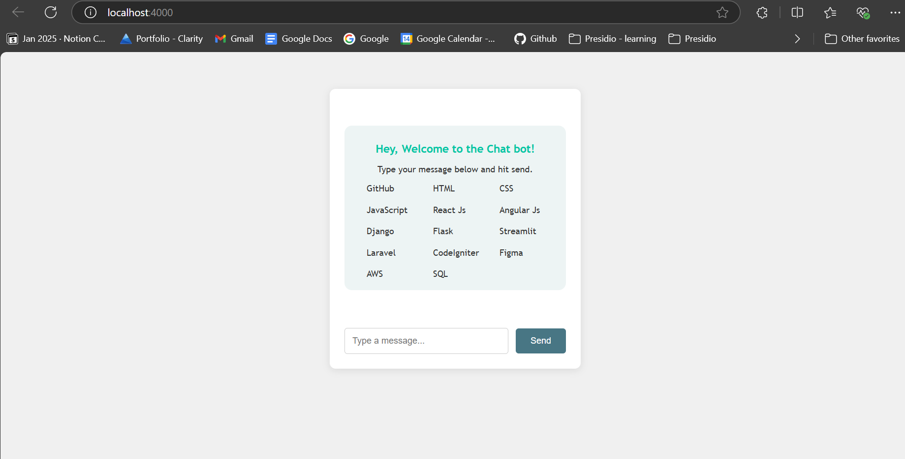
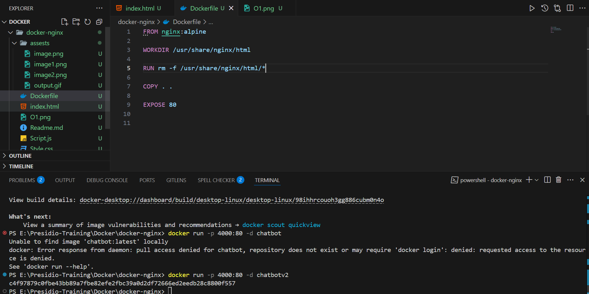

# Deploying the chatbot to the docker engine (using nginx)

- Created a frontend chat bot application and host it in a nginx by dockerized the application.

## Docker Commands

- `docker run nginx:alpine` - To install and run a nginx image.
- `docker ps` - To view the list of containers that are running and `-a` => shows all the stops containers also.
- `docker images` - Show the all the images present in the docker.
- `docker rm <container_name or id>` - Remove the specific container.
- `docker rmi <image_name>` - Remove the specific image present in the docker engine.
- `docker run <image_name> sleep seconds` - sleep helps to temporary stop of execution for the following seconds.
- `docker exec -it <container_name> /bin/sh` - exec runs a new command inside an already running container, `-it` makes an interactive environment inside the container.
- `docker run -d <container_name>` - Runs in a background without showing in the frontend.
- `docker run --name webapp nginx` - `--name` adds a name of the containers.
- `docker run -p <custom_standard_port>:<host_port> <container_name>` - `-p` helps to expose or publish the port for using in the outside environment.
- `docker build -t <tag_name>` - initialize the tag name for the container.

```dockerfile
FROM nginx:alpine

WORKDIR /usr/share/nginx/html

RUN rm -f /usr/share/nginx/html/*

COPY . .

EXPOSE 80

```

- `From` is a base foundation for the image.
- `WORKDIR` - Working directory present in the container.
- `RUN` - Run an task inside the container.
- `COPY` - Copy the current working dir to the container dir.
-`EXPOSE` - Publish a port

## Output





