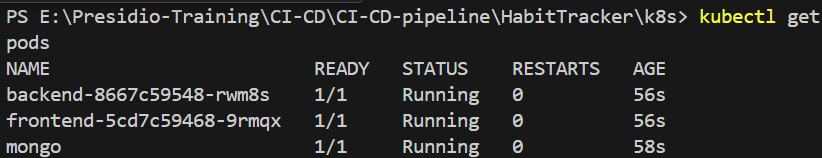
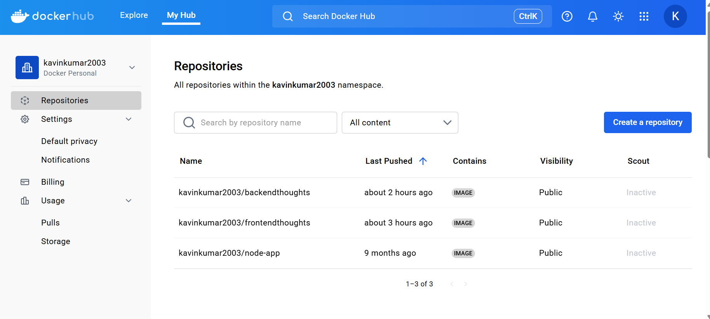

# Kubernetes (K8S)

- Open Source container orchestration tool, which can automates `deployment`, `scaling`, `managing` containers.
- Manage containerized application in different deployment environments.

## Features

- High Availability or no downtime
- Scalability or high performance
- Disaster recovery - back up and restore

## Components

### Node and Pod

- Node is a `worker` machine in k8s, that helps to run an application.
- Pod is the `smallest deployable`unit in k8s that wraps one or more containers.

### Service

- `Persist` the `IP` address, even after Pod dies.
- Lifecycle of pod and service not connected.

### Ingress

- It exposes HTTP and HTTPS routes from outside the cluster to services within the cluster.
- It is used for `route traffic` management into cluster.

### ConfigMap

- It is a external configuration of the application to store the unsensitive data like URL.

### Secret

- It is used to store data in a secret manner.
- Encoded data in base64.

### Volumes

- It ensure data is persisted
- allocate a physical memory or remote storage.

### Replicates

- Pod can be `replicated`, so if one fails other will be still `alive`.
- DB is not replicated directly because it contains stateful data for that `StatefulSet` is being used

## 3 Node Process in K8S

- Kubelet (CLI tool)
- Kube Proxy (Forward the requests)
- Container Runtime (make a app alive)

_Master node is responsible to schedule, monitor, re-start._

## Components inside the Master Node

- `API server` - Used a cluster gateway and it ensures the authentication.
- `Scheduler` - Make a decision which pod should go next.
- `Controller Manager` - Detects the cluster internal state changes.
- `etcd` - Key Value Store (records info like when the pod dies or new pod added)

## Kubectl - Commands

### Crud

```plaintext
kubectl create deployment [name]
```

```plaintext
kubectl edit deployment [name]
```

```plaintext
kubectl delete deployment [name]
```

### Status of K8S components

```plaintext
kubectl get nodes | pod | services | replicaset | deployment
```

### Debugging pods

```plaintext
kubectl log [pod name]
```

```plaintext
kubectl exec -it [pod name] --bin/bash
```

Interactive Terminal.

### Process

- Created a frontend and backend (Mongodb) to collect the user's thoughts and made it persistence by store in db.

- Build those as a docker image and push to the docker hub which is public.

- Created a `k8s.yaml` file to create a pods, services to keep up the application running.

- In a single `yaml` file the components of pipeline is separated by `---` dash in yaml.

- First created a MongoDB pod and its `containerPort` as `27017` (default one).

- Second create a service for mongodb which helps to interact with the mongodb pod.

- Third create a `Backend` deployment and its service.

- Fourth create a `frontend` deployment with its service.

- Also expose the port to `outside environment` by using `NodePort`.

### Frontend Docker file

```yaml
FROM node:18 AS build

WORKDIR /app
COPY . .

RUN npm install
RUN npm run build


FROM nginx:alpine

COPY --from=build /app/dist /usr/share/nginx/html

EXPOSE 80
CMD ["nginx", "-g", "daemon off;"]
```

### Backend Docker file

```yaml
FROM node:16

WORKDIR /app

COPY package*.json ./

RUN npm install

COPY . .

EXPOSE 30081

CMD ["node", "app.js"]
```

### K8s Manifest yaml file

```yaml
# ------------------ MongoDB Pod ------------------
apiVersion: v1
kind: Pod
metadata:
  name: mongo
  labels:
    app: mongo
spec:
  containers:
    - name: mongo
      image: mongo:latest
      ports:
        - containerPort: 27017
---
apiVersion: v1
kind: Service
metadata:
  name: mongo
spec:
  selector:
    app: mongo
  ports:
    - port: 27017
      targetPort: 27017
---
# ------------------ Backend Deployment & Service ------------------
apiVersion: apps/v1
kind: Deployment
metadata:
  name: backend
spec:
  replicas: 1
  selector:
    matchLabels:
      app: backend
  template:
    metadata:
      labels:
        app: backend
    spec:
      containers:
        - name: backend
          image: kavinkumar2003/backendthoughts:v1
          ports:
            - containerPort: 30081
          env:
            - name: MONGO_URL
              value: mongodb://mongo:27017/thoughtsDB
---
apiVersion: v1
kind: Service
metadata:
  name: backend
spec:
  selector:
    app: backend
  ports:
    - port: 30001
      targetPort: 30081
      nodePort: 30081
  type: NodePort
---
# ------------------ Frontend Deployment & Service ------------------
apiVersion: apps/v1
kind: Deployment
metadata:
  name: frontend
spec:
  replicas: 1
  selector:
    matchLabels:
      app: frontend
  template:
    metadata:
      labels:
        app: frontend
    spec:
      containers:
        - name: frontend
          image: kavinkumar2003/frontendthoughts:v1
          ports:
            - containerPort: 80
---
apiVersion: v1
kind: Service
metadata:
  name: frontend
spec:
  selector:
    app: frontend
  ports:
    - port: 3000
      targetPort: 80
      nodePort: 30000
  type: NodePort
```

### Output 





